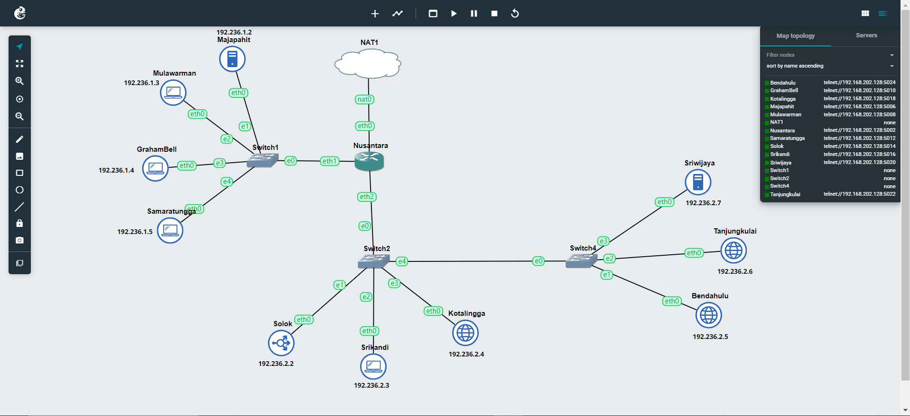

# Laporan Resmi Praktikum Jarkom Modul 2 2024

---
### Anggota Kelompok
- Rafika Az Zahra Kusumastuti  (5027231050)
- Johanes Edward Nathanael     (5027231067)

### Daftar Isi
- [Soal-1](#soal-1)
- [Soal-2](#soal-2)
- [Soal-3](#soal-3)
- [Soal-4](#soal-4)
- [Soal-5](#soal-5)
- [Soal-6](#soal-6)
- [Soal-7](#soal-7)
- [Soal-8](#soal-8)
- [Soal-9](#soal-9)
- [Soal-10](#soal-10)
- [Soal-11](#soal-11)
- [Soal-12](#soal-12)
- [Soal-13](#soal-13)
- [Soal-14](#soal-14)
- [Soal-15](#soal-15)
- [Soal-16](#soal-17)
- [Soal-18](#soal-18)
- [Soal-19](#soal-19)
- [Soal-20](#soal-20)

-----
Sebuah kerajaan besar di Indonesia sedang mengalami pertempuran dengan penjajah. Kerajaan tersebut adalah **Sriwijaya**. Karena merasa terdesak **Sriwijaya** meminta bantuan pada **Majapahit** untuk mempertahankan wilayahnya. Pertempuran besar tersebut berada di **Nusantara**. Untuk topologi (3)
## Topologi


### Network Configuration
Nusantara (Router)
```
auto eth0
iface eth0 inet dhcp
up iptables -t nat -A POSTROUTING -o eth0 -j MASQUERADE -s 192.236.0.0/

auto eth1
iface eth1 inet static
	address 192.236.1.1
	netmask 255.255.255.0

auto eth2
iface eth2 inet static
	address 192.236.2.1
	netmask 255.255.255.0
```

Samaratungga (Client)
```
auto eth0
iface eth0 inet static
	address 192.236.1.2
	netmask 255.255.255.0
	gateway 192.236.1.1
	up echo nameserver 192.236.2.4 > /etc/resolv.conf
        up echo nameserver 192.236.1.5 >> /etc/resolv.conf
```

GrahamBell (Client)
```
auto eth0
iface eth0 inet static
	address 192.236.1.3
	netmask 255.255.255.0
	gateway 192.236.1.1
	up echo nameserver 192.236.2.4 > /etc/resolv.conf
        up echo nameserver 192.236.1.5 >> /etc/resolv.conf
```

Mulawarman (Client)
```
auto eth0
iface eth0 inet static
	address 192.236.1.4
	netmask 255.255.255.0
	gateway 192.236.1.1
	up echo nameserver 192.236.2.4 > /etc/resolv.conf
        up echo nameserver 192.236.1.5 >> /etc/resolv.conf
```

Majapahit (DNS Slave)
```
auto eth0
iface eth0 inet static
	address 192.236.1.5
	netmask 255.255.255.0
	gateway 192.236.1.1
	up echo nameserver 192.168.122.1 > /etc/resolv.conf
```

Bedahulu (Web Server)
```
auto eth0
iface eth0 inet static
	address 192.236.2.2
	netmask 255.255.255.0
	gateway 192.236.2.1
	up echo nameserver 192.168.122.1 > /etc/resolv.conf
```

Tanjungkulai (Web Server)
```
auto eth0
iface eth0 inet static
	address 192.236.2.3
	netmask 255.255.255.0
	gateway 192.236.2.1
	up echo nameserver 192.168.122.1 > /etc/resolv.conf
```

Sriwijaya (DNS Master)
```
auto eth0
iface eth0 inet static
	address 192.236.2.4
	netmask 255.255.255.0
	gateway 192.236.2.1
	up echo nameserver 192.168.122.1 > /etc/resolv.conf
```

Srikandi (Client)
```
auto eth0
iface eth0 inet static
	address 192.236.2.5
	netmask 255.255.255.0
	gateway 192.236.2.1
	up echo nameserver 192.236.2.4 > /etc/resolv.conf
        up echo nameserver 192.236.1.5 >> /etc/resolv.conf
```

Solok (Load Balancer)
```
auto eth0
iface eth0 inet static
	address 192.236.2.6
	netmask 255.255.255.0
	gateway 192.236.2.1
	up echo nameserver 192.168.122.1 > /etc/resolv.conf
```

Kotalingga (Web Server)
```
auto eth0
iface eth0 inet static
	address 192.236.2.7
	netmask 255.255.255.0
	gateway 192.236.2.1
	up echo nameserver 192.168.122.1 > /etc/resolv.conf
```


## Soal 1
Untuk mempersiapkan peperangan World War MMXXIV (Iya sebanyak itu), **Sriwijaya** membuat dua kotanya menjadi web server yaitu **Tanjungkulai**, dan **Bedahulu**, serta **Sriwijaya** sendiri akan menjadi DNS Master. Kemudian karena merasa terdesak, **Majapahit** memberikan bantuan dan menjadikan kerajaannya (**Majapahit**) menjadi **DNS Slave**.

### Nusantara
```
up iptables -t nat -A POSTROUTING -o eth0 -j MASQUERADE -s 192.236.0.0/16=
```

### Tanjungkulai 
```
up echo nameserver 192.236.2.7 > /etc/resolv.conf
up echo nameserver 192.236.1.2 >> /etc/resolv.conf
up echo nameserver 192.168.122.1 >> /etc/resolv.conf
```
### Bedahulu
```
up echo nameserver 192.236.2.7 > /etc/resolv.conf
up echo nameserver 192.236.1.2 >> /etc/resolv.conf
up echo nameserver 192.168.122.1 >> /etc/resolv.conf
```
### Sriwijaya
```
up echo nameserver 192.236.2.7 > /etc/resolv.conf
up echo nameserver 192.168.122.1 >> /etc/resolv.conf
```
### Majapahit 
```
up echo nameserver 192.168.122.1 >> /etc/resolv.conf
```
### Kotalingga
```
up echo nameserver 192.236.2.7 > /etc/resolv.conf
up echo nameserver 192.236.1.2 >> /etc/resolv.conf
up echo nameserver 192.168.122.1 >> /etc/resolv.conf
```
### Solok
```
up echo nameserver 192.236.2.7 > /etc/resolv.conf
up echo nameserver 192.236.1.2 >> /etc/resolv.conf
up echo nameserver 192.168.122.1 >> /etc/resolv.conf
```


## Soal 2
Karena para pasukan membutuhkan koordinasi untuk melancarkan serangannya, maka buatlah sebuah domain yang mengarah ke **Solok** dengan alamat **sudarsana.xxxx.com** dengan alias **www.sudarsana.xxxx.com**, dimana xxxx merupakan kode kelompok. Contoh: **sudarsana.it01.com.**

Masuk Ke Web Console Sriwijaya 

1. `apt install bind9 dnsutils -y`

2. `cd /etc/bind`

3. Lakukan edit pada named server

4. `nano named.conf.local`


5. `mkdir /etc/bind/it39`

6. `cp ../db.local sudarsana.it39.com`

7. `nano sudarsana.it39.com`


8. `service bind9 restart`

9. `ping sudarsana.it39.com`


## Soal 3
Para pasukan juga perlu mengetahui mana titik yang akan diserang, sehingga dibutuhkan domain lain yaitu **pasopati.xxxx.com** dengan alias **www.pasopati.xxxx.com** yang mengarah ke **Kotalingga**.

Masuk Ke Web Console Sriwijaya 

2. `cd /etc/bind`

3. Lakukan edit pada named server

4. `nano named.conf.local`


5. `cd it39`

6. `cp pasopati.it39.com`

7. `nano pasopati.it39.com`


8. `service bind9 restart`

9. `ping pasopati.it39.com` 


## Soal 4
Markas pusat meminta dibuatnya domain khusus untuk menaruh informasi persenjataan dan suplai yang tersebar. Informasi dan suplai meme terbaru tersebut mengarah ke Tanjungkulai dan domain yang ingin digunakan adalah **rujapala.xxxx.com** dengan alias **www.rujapala.xxxx.com.**

### Lakukan Step yang sama dengan No 2 & 3 


## Soal 5 
Pastikan domain-domain tersebut dapat diakses oleh **seluruh komputer (client)** yang berada di **Nusantara**.

1. Masuk ke Web Console Client(laptop(bebas))

2. Jalanin Command di Console 

```
echo nameserver 192.236.2.7 >> /etc/resolv.conf
```
```
echo nameserver 192.236.1.2 >> /etc/resolv.conf
```


## Soal 6
Beberapa daerah memiliki keterbatasan yang menyebabkan hanya dapat mengakses domain secara langsung melalui **alamat IP** domain tersebut. Karena daerah tersebut tidak diketahui secara spesifik, pastikan semua komputer (client) dapat mengakses domain **pasopati.xxxx.com** melalui **alamat IP Kotalingga** (Notes: menggunakan pointer record).

1. Masukke Web Console Sriwijaya 

2. cd /etc/bind

3. `nano named.conf.local` & tambahkan zone baru: 
```
zone "192.236.2.in-addr.arpa" {
  type master;
  file "/etc/bind/it39/192.236.2.in-addr.arpa";
};
```

4. `cd it39`

5. `cp pasopati.it39.com 192.236.2.in-addr.arpa`

6. `service bind9 restart`

7. Masuk ke Web Console Client (laptop(bebas))

8. `apt install dnsutils -y`

9. Pastiin udah ada nameserver si DNS di /etc/resolv.conf

10. `host -t	PTR 192.236.2.4`


# Dokumentasi Menyerah Karena Error ^^


## Soal 7

Akhir-akhir ini seringkali terjadi **serangan brainrot** ke DNS Server Utama, sebagai tindakan antisipasi kamu diperintahkan untuk membuat **DNS Slave di Majapahit** untuk semua domain yang sudah dibuat sebelumnya yang mengarah ke **Sriwijaya.**

Pada Sriwijaya
1. `nano /etc/bind/named.conf.local`
2. 
```
zone "sudarsana.it39.com" {
		type master;
		also-notify { 192.236.1.5; }; // IP Majapahit
		allow-transfer { 192.236.1.5; }; // IP Majapahit
		file "/etc/bind/it39/sudarsana.it39.com";
};

zone "pasopati.it39.com" {
		type master;
		also-notify { 192.236.1.5; }; // IP Majapahit
		allow-transfer { 192.236.1.5; }; // IP Majapahit
		file "/etc/bind/it39/pasopati.it39.com";
};

zone "rujapala.it39.com" {
		type master;		
		also-notify { 192.236.1.5; }; // IP Majapahit
		allow-transfer { 192.236.1.5; }; // IP Majapahit
		file "/etc/bind/it39/rujapala.it39.com";
};

zone "2.236.192.in-addr.arpa" {
		type master;
		also-notify { 192.236.1.5; }; // IP Majapahit
		allow-transfer { 192.236.1.5; }; // IP Majapahit
		file "/etc/bind/it39/2.236.192.in-addr.arpa";
};
```
3. `service bind9 restart`

Pada Majapahit
1. 
```
apt-get update
apt-get install bind9 -y
```
2. `service bind9 start`
3. 
```
zone "sudarsana.it39.com" {
		type slave;
		masters { 192.236.2.4; }; //IP Sriwijaya
		file "/var/lib/bind/sudarsana.it39.com";
};

zone "pasopati.it39.com" {
		type slave;
		masters { 192.236.2.4; }; //IP Sriwijaya
		file "/var/lib/bind/pasopati.it39.com";
};

zone "rujapala.it39.com" {
		type slave;
		masters { 192.236.2.4; }; //IP Sriwijaya
		file "/var/lib/bind/rujapala.it39.com";
};

zone "2.236.192.in-addr.arpa" {
		type slave;
		masters { 192.236.2.4; }; //IP Sriwijaya
		file "/var/lib/bind/2.236.192.in-addr.arpa";
};
```
4. `service bind9 restart`

Saat Sriwijaya mati dan Majapahit nyala, test semua client
```
ping sudarsana.it39.com
ping rujapala.it39.com
ping pasopati.it39.com
```


## Soal 8
Kamu juga diperintahkan untuk membuat subdomain khusus melacak kekuatan tersembunyi **di Ohio** dengan subdomain **cakra.sudarsana.xxxx.com** yang mengarah ke Bedahulu.

1. `nano sriwijaya8.bash`
2. 
```
;
; BIND data file for local loopback interface
;
$TTL    604800
@       IN      SOA     sudarsana.it39.com. root.sudarsana.it39.com. (
                              2         ; Serial
                         604800         ; Refresh
                          86400         ; Retry
                        2419200         ; Expire
                         604800 )       ; Negative Cache TTL
;
@       IN      NS      sudarsana.it39.com.
@       IN      A       192.236.2.6
@       IN      AAAA    ::1
www     IN      CNAME   sudarsana.it39.com.
cakra		IN      A       192.236.2.2
www.cakra	IN      CNAME   cakra.sudarsana.it39.com.
```
3. `chmod +x sriwijaya8.bash`
4. `./sriwijaya8.bash`
4. `service bind9 restart`
5. Tes semua client menggunakan command `ping cakra.sudarsana.it39.com`


## Soal 9
Karena terjadi serangan DDOS oleh shikanoko nokonoko koshitantan (NUN), sehingga sistem komunikasinya terhalang. Untuk melindungi warga, kita diperlukan untuk membuat sistem peringatan dari siren man oleh Frekuensi Freak dan memasukkannya ke subdomain **panah.pasopati.xxxx.com** dalam folder panah dan pastikan dapat diakses secara mudah dengan menambahkan alias **www.panah.pasopati.xxxx.com** dan mendelegasikan subdomain tersebut ke **Majapahit** dengan alamat IP menuju radar di **Kotalingga.**


## Soal 10 
Markas juga meminta catatan kapan saja meme brain rot akan dijatuhkan, maka buatlah subdomain baru di subdomain panah yaitu **log.panah.pasopati.xxxx.com** serta aliasnya **www.log.panah.pasopati.xxxx.com** yang juga mengarah ke **Kotalingga.**

1. `nano majapahit10.bash`

```
#!/bin/bash

# Tambahkan konfigurasi untuk membuat subdomain log.panah.pasopati.it39.com
echo '
;
; BIND data file for local loopback interface
;
$TTL    604800
@       IN      SOA     panah.pasopati.it39.com. panah.pasopati.it39.com. (
                        2024050301      ; Serial
                         604800         ; Refresh
                          86400         ; Retry
                        2419200         ; Expire
                         604800 )       ; Negative Cache TTL
;
@       IN      NS      panah.pasopati.it39.com.
@       IN      A       192.236.2.7     ; IP Kotalingga
www     IN      CNAME   panah.pasopati.it39.com.
log     IN      A       192.236.2.7     ; IP Kotalingga
www.log IN      CNAME   panah.pasopati.it39.com.' > /etc/bind/panah/panah.pasopati.it39.com

service bind9 restart
```
3. `chmod +x majapahit10.bash`
4. `./majapahit10.bash`

Test pada tiap client
`ping log.panah.pasopati.it39.com`


## Soal 11
Setelah pertempuran mereda, warga IT dapat kembali mengakses jaringan luar dan menikmati meme brainrot terbaru, tetapi **hanya** warga 
**Majapahit** saja yang dapat mengakses jaringan luar secara **langsung**. Buatlah konfigurasi agar warga IT yang berada diluar Majapahit dapat mengakses jaringan luar **melalui** DNS Server **Majapahit.**

Pada Sriwijaya
1. `nano sriwijaya11.bash`
2. 
```
#!/bin/bash

# Tambahkan konfigurasi untuk DNS forwarder
echo '
options {
        directory "/var/cache/bind";

        forwarders {
                192.168.122.1; //IP Nusantara
        };
        //dnssec-validation auto;
        allow-query{any;};

        auth-nxdomain no;    # conform to RFC1035
        listen-on-v6 { any; };
};' > /etc/bind/named.conf.options

service bind9 restart
```
3. `chmod +x sriwijaya11.bash`
4. `./sriwijaya11.bash`

Pada Majapahit
1. `nano majapahit11.bash`
2. 
```
#!/bin/bash

# Tambahkan konfigurasi untuk DNS forwarder
echo '
options {
        directory "/var/cache/bind";

        forwarders {
                192.168.122.1; // IP Nusantara
        };
        //dnssec-validation auto;
        allow-query{any;};

        auth-nxdomain no;    # conform to RFC1035
        listen-on-v6 { any; };
};' > /etc/bind/named.conf.options

service bind9 restart
```
3. `chmod +x majapahit11.bash`
4. `./majapahit11.bash`

Test pada tiap client
`ping google.com`


## Soal 12
Karena pusat ingin sebuah laman web yang ingin digunakan untuk memantau kondisi kota lainnya maka deploy laman web ini (cek resource yg lb) pada **Kotalingga** menggunakan **apache.**

## Soal 13
Karena Sriwijaya dan Majapahit memenangkan pertempuran ini dan memiliki banyak uang dari hasil penjarahan (sebanyak 35 juta, belum dipotong pajak) maka pusat meminta kita memasang load balancer untuk membagikan uangnya pada web nya, dengan **Kotalingga, Bedahulu, Tanjungkulai** sebagai worker dan **Solok** sebagai **Load Balancer** menggunakan apache sebagai web server nya dan load balancer nya.

## Soal 14
Selama melakukan penjarahan mereka melihat bagaimana web server luar negeri, hal ini membuat mereka iri, dengki, sirik dan ingin flexing sehingga meminta agar web server dan load balancer nya **diubah menjadi nginx.**

## Soal 15
Markas pusat meminta **laporan hasil benchmark** dengan menggunakan apache benchmark dari load balancer dengan 2 web server yang berbeda tersebut dan meminta secara detail dengan ketentuan:
Nama Algoritma Load Balancer
Report hasil testing apache benchmark 
Grafik request per second untuk masing masing algoritma. 
Analisis
Meme terbaik kalian (terserah ( ͡° ͜ʖ ͡°)) 🤓

## Soal 16
Karena dirasa kurang aman dari brainrot karena masih memakai IP, markas ingin akses ke **Solok** memakai **solok.xxxx.com** dengan alias **www.solok.xxxx.com** (sesuai web server terbaik hasil analisis kalian).

## Soal 17
Agar aman, buatlah konfigurasi agar **solok.xxx.com hanya dapat diakses** melalui **port sebesar π x 10^4 = (phi nya desimal) dan** 2000 + 2000 log 10 (10) +700 - π **= ?.**

## Soal 18
Apa bila ada yang mencoba mengakses IP solok akan secara otomatis dialihkan ke **www.solok.xxxx.com.**

## Soal 19
Karena probset sudah kehabisan ide masuk ke **salah satu** worker buatkan akses direktori listing yang mengarah ke resource worker2.

## Soal 20 
Worker tersebut harus dapat di akses dengan **sekiantterimakasih.xxxx.com** dengan alias **www.sekiantterimakasih.xxxx.com.**

